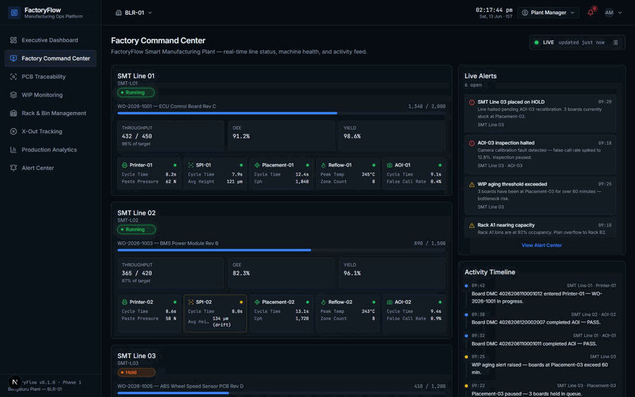
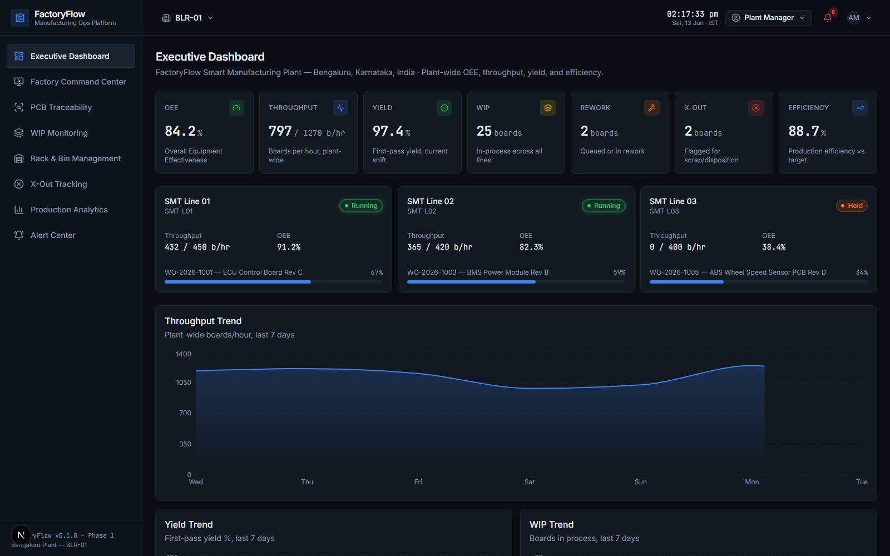
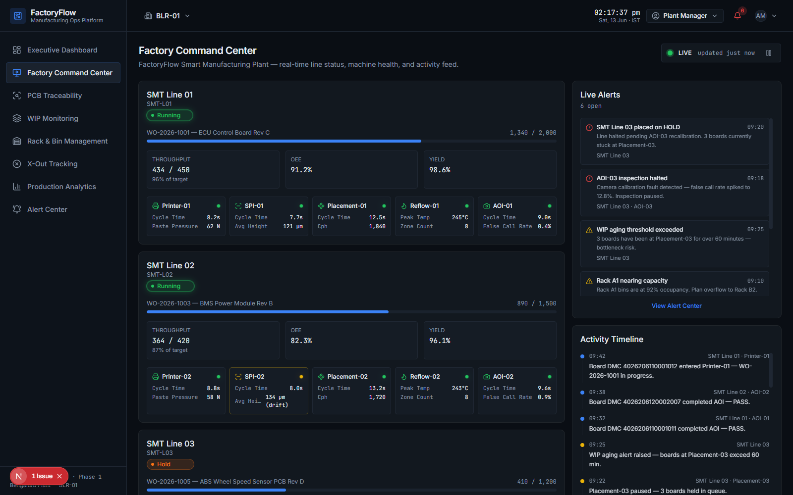
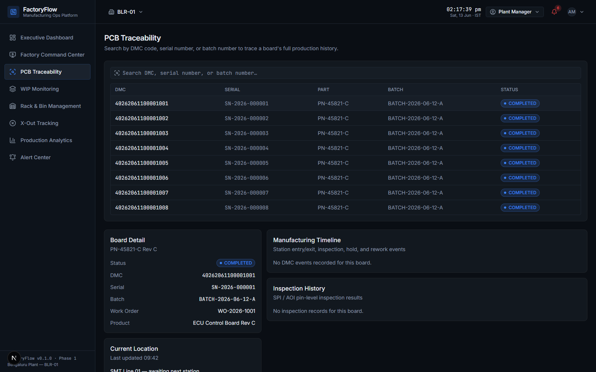
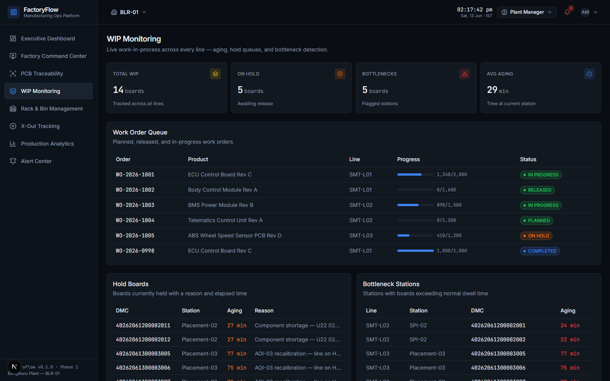

# FactoryFlow

**An Industry 4.0 MES-style operations console for SMT/PCB assembly plants** — real-time line status, machine health, work order tracking, and full DMC-level board traceability, styled after Bosch Nexeed, Siemens Opcenter, and Palantir Foundry-class operations consoles.


%20·%20Backend%20Planned-3B82F6)

---

## Demo



> Live, ticking factory floor — line cards, machine tiles, OEE/throughput, and the alert feed all update in real time via a Zustand simulation loop.

## Overview

FactoryFlow models a 3-line SMT (Surface-Mount Technology) assembly plant — Printer → SPI → Placement → Reflow → AOI — and gives plant managers, supervisors, and quality engineers a single pane of glass across plant-wide KPIs, live factory floor status, PCB traceability, warehouse management, and quality/defect tracking.

The domain model — DMC codes, SPI inspection pins (height/volume/area), and defect taxonomy — is grounded in a real Bosch SMT Solder Paste Inspection (SPI) tool, so the data shapes and workflows reflect an actual production line rather than a generic CRUD demo.

> All 8 modules below are fully built and run on typed mock data (`src/lib/mock-data/`) — clone and run with no database setup. The Prisma schema documents the live-data path; see [Roadmap](#roadmap).

## Features

| Module | Route | Description |
|---|---|---|
| **Executive Dashboard** | `/` | Plant-wide KPIs — OEE, throughput, yield, WIP, rework, X-Out — with animated tiles and trend charts |
| **Factory Command Center** | `/command-center` | Per-line cards with machine tiles, live alert feed, and activity timeline, driven by a Zustand live-simulation loop |
| **PCB Traceability** | `/traceability` | DMC/serial/batch search with full production history timeline and SPI/AOI inspection results |
| **WIP Monitoring** | `/wip` | Live work-in-progress table — current station, aging time, bottleneck and hold flags |
| **Rack & Bin Management** | `/racks` | Warehouse rack/bin occupancy with board-to-bin location lookup |
| **X-Out Tracking** | `/xout` | X-Out board list with reason codes, defect location, and disposition (scrap/rework) breakdown |
| **Production Analytics** | `/analytics` | OEE breakdown (availability/performance/quality), throughput, yield, and downtime trend charts |
| **Alert Center** | `/alerts` | Unified feed of critical/warning/info alerts across the plant |

## Architecture

FactoryFlow is a Next.js App Router application. The current build ships as a frontend-only system running on typed mock fixtures; the Prisma schema and API design document the production architecture the UI is built to slot into without structural changes.

```
Browser
 ├─ Next.js App Router UI  ──►  Component library (dashboard / command-center / layout / ui)
 │        │                              │
 │        └─────────► Zustand store ◄────┘   (live simulation: tick() every 3s)
 │                          │
 └──────────────► src/lib/mock-data  ◄─.mirrors.─  src/lib/types.ts
                             │
                  (Phase 5+, planned)
                             ▼
                  REST API → PostgreSQL (Prisma) → MQTT/WebSocket ingestion → AI Copilot
```

See [docs/ARCHITECTURE.md](docs/ARCHITECTURE.md) for the full system diagram (Mermaid), [docs/ERD.md](docs/ERD.md) for the database design, and [docs/API_DESIGN.md](docs/API_DESIGN.md) for the planned REST contract.

## Tech Stack

| Layer | Choice |
|---|---|
| Framework | Next.js 16 (App Router, TypeScript, Turbopack) |
| UI | shadcn/ui (Base UI primitives), Tailwind CSS v4 |
| Animation | Framer Motion |
| Charts | Recharts |
| State | Zustand (live simulation layer) |
| Data layer | Prisma 7 schema (PostgreSQL) — current build runs on typed mock fixtures |
| Icons | lucide-react |

### Design System

A single industrial dark theme drives every surface — near-black backgrounds, sharp 4–8px radii, and a 6-color status system used consistently across lines, machines, boards, and alerts:

| Status | Color | Meaning |
|---|---|---|
| Running | 🟢 `#22C55E` | Normal operation |
| Completed | 🔵 `#3B82F6` | Finished / shipped |
| Warning | 🟡 `#EAB308` | Degraded, needs attention |
| Hold | 🟠 `#F97316` | Paused, awaiting action |
| Critical | 🔴 `#EF4444` | Fault, halted |
| Offline | ⚪ `#6B7280` | Not reporting |

## Screenshots

| Executive Dashboard | Factory Command Center |
|---|---|
|  |  |

| PCB Traceability | WIP Monitoring |
|---|---|
|  |  |

> Capture instructions: [docs/screenshots/README.md](docs/screenshots/README.md)

## Getting Started

```bash
npm install
npm run dev
```

Open [http://localhost:3070](http://localhost:3070).

No environment variables or database are required — the app runs entirely on typed mock data in `src/lib/mock-data/`. The Prisma schema in `prisma/schema.prisma` documents the production data model; see `prisma/seed.ts` for how the mock fixtures map to seed rows once a Postgres database is connected.

### Scripts

| Command | Description |
|---|---|
| `npm run dev` | Start the dev server on port 3070 |
| `npm run build` | Production build |
| `npm run start` | Start the production server |
| `npm run lint` | Run ESLint |

## Project Structure

```
src/
├── app/
│   ├── (dashboard)/        # Sidebar + topbar shell, all 8 module pages
│   │   ├── page.tsx           # Executive Dashboard
│   │   ├── command-center/    # Factory Command Center
│   │   ├── traceability/       # PCB Traceability
│   │   ├── wip/ racks/ xout/ analytics/ alerts/
│   │   └── layout.tsx         # AppSidebar + TopBar shell
│   ├── globals.css           # Industrial dark theme tokens
│   └── layout.tsx            # Root layout, fonts
├── components/
│   ├── dashboard/             # KPI tiles, charts, line status strip
│   ├── command-center/        # Line cards, machine tiles, live alert feed, activity timeline
│   ├── layout/                 # AppSidebar, TopBar, StatusBadge
│   └── ui/                     # shadcn/ui primitives
├── lib/
│   ├── types.ts               # Domain types mirroring the Prisma schema
│   ├── design-tokens.ts       # Status color system + helper mappers
│   ├── mock-data/              # Typed fixtures (factories, lines, machines, boards, alerts, events, KPIs)
│   ├── format-time.ts
│   └── nav.ts                  # Sidebar navigation config
└── store/
    └── command-center-store.ts  # Zustand live-simulation store

prisma/
├── schema.prisma              # Full PostgreSQL schema (17 models)
└── seed.ts                     # Documented seed stub (mock fixtures → seed rows)
```

## Live Simulation

The Factory Command Center includes a lightweight client-side simulation (Zustand `tick()` on a 3s interval) that nudges line throughput and machine cycle times to give a "live floor" feel. This is a stand-in for the real-time WebSocket/MQTT ingestion layer planned for Phase 5 — see [docs/ARCHITECTURE.md](docs/ARCHITECTURE.md#real-time-architecture).

## Roadmap

| Phase | Focus | Status |
|---|---|---|
| 1 — Core Platform | Project scaffold, design system, Prisma schema, mock data layer, Executive Dashboard, Command Center | ✅ UI complete |
| 2 — PCB Traceability | DMC/serial/batch search, board history timeline, inspection grid | ✅ UI complete |
| 3 — WIP & Rack/Bin Management | WIP table with aging/bottlenecks, rack/bin warehouse view | ✅ UI complete |
| 4 — X-Out & Production Analytics | X-Out/rework workflow, OEE/defect/throughput analytics | ✅ UI complete |
| 5 — Real-Time Monitoring | REST API routes for all modules, MQTT → API → WebSocket ingestion, Prisma + live Postgres, JWT auth & RBAC, Alert Center actions | 🔜 Planned |
| 6 — AI Manufacturing Copilot | Natural-language queries over KPIs/events/alerts/board history | 🔜 Planned |

All UI modules (Phases 1–4) run on typed mock data today. The REST API layer for these modules (see [docs/API_DESIGN.md](docs/API_DESIGN.md)) is part of the Phase 5 backend rollout. See [docs/ROADMAP.md](docs/ROADMAP.md) for the full breakdown.

## Documentation

- [Architecture](docs/ARCHITECTURE.md) — system design, folder structure, real-time architecture
- [Entity-Relationship Diagram](docs/ERD.md) — full database schema
- [API Design](docs/API_DESIGN.md) — REST contract for all 8 modules
- [Roadmap](docs/ROADMAP.md) — 6-phase delivery plan

## License

[MIT](LICENSE) © 2026 Dharshan Sai S
