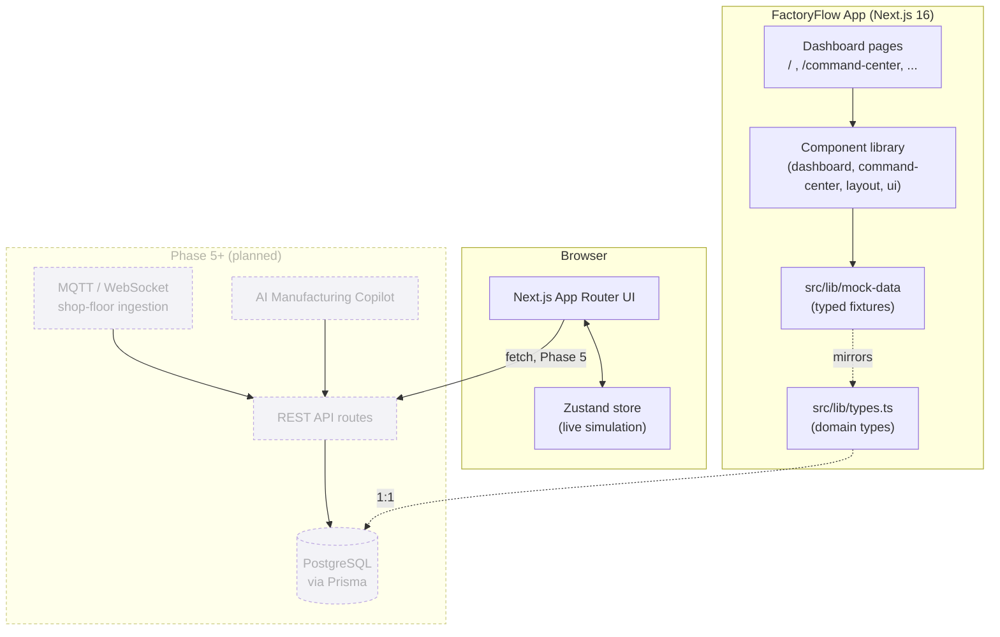

# Architecture

## System Overview

FactoryFlow is a Next.js App Router application. Phase 1 ships as a frontend-only system running on typed mock fixtures; the Prisma schema and API design document the production architecture that the UI is built to slot into without structural changes.



## Layers

### 1. Presentation (`src/app`)

- **Root layout** (`src/app/layout.tsx`) — fonts (Inter, JetBrains Mono via `next/font`), `TooltipProvider`, global theme.
- **Dashboard route group** (`src/app/(dashboard)/layout.tsx`) — wraps every module page with `AppSidebar` + `TopBar`. Route groups keep the shell DRY without affecting URL paths (`/` resolves to `(dashboard)/page.tsx`).
- **Module pages** — one folder per nav item (`/`, `/command-center`, `/traceability`, `/wip`, `/racks`, `/xout`, `/analytics`, `/alerts`). Unbuilt modules render `ComingSoon` with a phase label and feature preview so navigation always feels complete.

### 2. Components (`src/components`)

- **`ui/`** — shadcn/ui primitives (Card, Badge, Sheet, DropdownMenu, ScrollArea, etc.) on `base-ui`.
- **`layout/`** — `AppSidebar`, `TopBar` (factory selector, role switcher, live clock, alert bell, user menu), `StatusBadge`/`StatusDot`, `ComingSoon`.
- **`dashboard/`** — Executive Dashboard: `KPITile`/`KPIRow` (Framer Motion count-up), `LineStatusStrip`, and Recharts wrappers (`ThroughputChart`, `YieldChart`, `WIPChart`, `UtilizationChart`) sharing a `ChartCard` + `ChartTooltip`.
- **`command-center/`** — `LineCard`, `MachineTile`, `LiveAlertFeed`, `ActivityTimeline`, `LiveIndicator`.

### 3. Domain & Data (`src/lib`)

- **`types.ts`** — TypeScript interfaces mirroring every Prisma model field-for-field (`ProductionLine`, `Machine`, `Board`, `Alert`, `KPISummary`, etc.), plus dashboard-only aggregate types.
- **`design-tokens.ts`** — single source of truth for the 6-color status system (`STATUS_STYLES`) and mapper functions (`lineStatusToStatusKey`, `machineStatusToStatusKey`, `boardStatusToStatusKey`, `alertSeverityToStatusKey`) that translate domain enums into UI tone.
- **`mock-data/`** — typed fixtures: 1 factory, 3 production lines, 15 machines, 6 work orders, 40 boards, 10 alerts, 30 production events, and KPI summary/trend series. Because these match `types.ts` 1:1, swapping to a live Prisma client is a drop-in replacement with no component changes.

### 4. State (`src/store`)

- **`command-center-store.ts`** — Zustand store seeded from `mock-data`. `tick()` nudges `currentThroughput` on running lines and `cycleTime` on running machines by small random deltas.
- **`use-live-tick.ts`** — hook that calls `tick()` on a configurable interval while `isLive` is true, paused via `LiveIndicator`.

### 5. Data Model (`prisma/`)

- **`schema.prisma`** — 17-model PostgreSQL schema covering access control, factory/line/machine topology, work orders & boards, DMC traceability, WIP, rack/bin warehouse, quality (X-Out/rework/inspection), and events/alerts/audit. See [ERD.md](ERD.md).
- **`seed.ts`** — documented stub mapping each `mock-data` fixture to the `prisma.createMany` calls that would seed a real database.

## Real-Time Architecture

### Current (Phase 1)

The Command Center simulates "live" data entirely client-side:

```
mock-data (static fixtures)
   → Zustand store (initial state)
   → setInterval (3s) → tick() → small random deltas
   → React re-render via Zustand subscriptions
```

This is intentionally scoped to throughput and cycle-time metrics — enough to demonstrate live-update UI patterns (animated counters, pulsing status dots, "updated Ns ago") without a backend.

### Planned (Phase 5)

```
Shop-floor PLCs/SPI/AOI → MQTT broker → ingestion API route
   → PostgreSQL (Prisma) → ProductionEvent / Alert rows
   → WebSocket (or SSE) → client subscriptions
   → Zustand store hydrated from server push (replaces tick())
```

The `ProductionEvent` and `Alert` models, plus the `DMCRecord` append-only log, are designed so this transition only changes the data source — UI components already consume the same `types.ts` shapes.

## Deployment

Phase 1 is a standard Next.js app (`npm run build && npm run start`), deployable to any Node host or Vercel. No environment variables or external services are required until a database is connected (Phase 2+).
