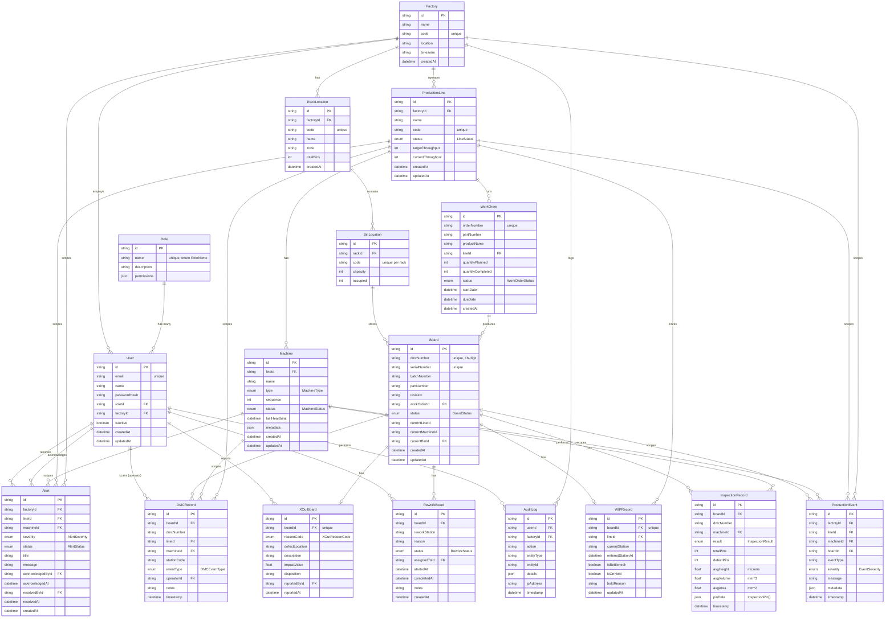

# Entity-Relationship Diagram

Generated from [`prisma/schema.prisma`](../prisma/schema.prisma) — 17 models across access control, factory topology, work orders/boards, traceability, WIP, rack/bin warehouse, quality, and events/alerts/audit.

> Phase 1 ships against typed mock fixtures in `src/lib/mock-data/` (see `src/lib/types.ts`). This schema documents the production data model for Phase 2+.

## Notes

- All primary keys use `cuid()`. Table names are mapped to `snake_case` via `@@map`.
- `InspectionRecord.pinData` mirrors the `InspectionPin[]` shape (`pinId, x, y, height, volume, area, status, defectType`) from the source Bosch SPI tool — see [`src/lib/types.ts`](../src/lib/types.ts).
- `Board.currentLineId` / `currentMachineId` are denormalized for fast "where is this board right now" lookups on the WIP and Command Center views; `DMCRecord` remains the append-only source of truth for full history.
- `Alert` has two named relations to `User` (`AlertAcknowledgedBy`, `AlertResolvedBy`) to track the acknowledge/resolve workflow independently.
